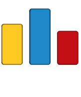

  

 
 

**_"Hard work beats talent when talent doesn't work hard."_**

# Hey, I'm [Abdelrahman!](https://www.linkedin.com/in/abdelrahman-hamdy-b42233194/)

 

  

  
  

 
  

 
 

#  About Me

- 🔭 Full Stack Developer <a href="https://www.ejada.com/">@EJADA</a>

- 🔭 Former Software Developer <a href="https://www.corporatica.com/">@Corporatica</a>

- 🔭 Former SWE Intern <a href="https://www.master-micro.com/">@Master Micro</a>

- 🎓 Computer Engineering Student <a href="http://eng.cu.edu.eg/ar/">@Faculty of Engineering Cairo University</a>

- 🏃‍♂️ I am passionate about the field of Computer Science and how it progresses everyday

- 🚧 I'm currently focused on Backend Web Development, AI and Problem Solving

- 💬 Ask me about anything, I'll be happy to help!

# 🧰 My Skills

<code></code>
<code></code>
<code></code>
<code></code>
<code></code>
<code></code>
<code></code>
<code></code>
<code></code>
<code></code>
<code></code>

 
  
<code></code>
<code></code>
<code></code>
<code></code>
<code></code>
<code></code>
<code></code>
<code></code>
<code></code>
<code></code>
<code></code>

 
  
<code></code>
<code></code>
<code></code>
<code></code>
<code></code>
<code></code>
<code></code>
<code></code>
<code></code>
<code></code>
<code></code>

 

# 📊 Github Stats

 

# ⚡ Recent GitHub Activity

 

# 🏆 Github Profile Trophies

  

<h2 align="center">Have a Look at my CV:   </h2>
<h3 align="center">Show some &nbsp;❤️&nbsp; by starring some of the repositories!</h3>
